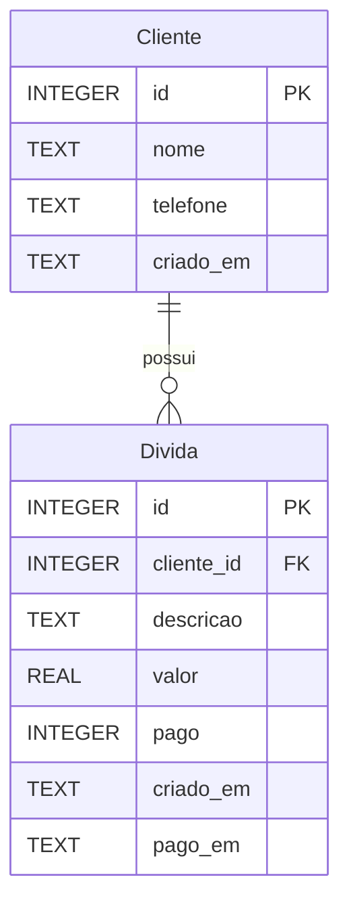

# Pendurator 📒

> App mobile de controle de dívidas e clientes — o "caderninho de fiado" digital.

---

## Sobre o app

**Pendurator** é um aplicativo mobile voltado para pequenos comerciantes, autônomos ou qualquer pessoa que precise registrar e acompanhar dívidas de clientes de forma simples e offline-first. A ideia é substituir o clássico "caderninho de fiado" por uma solução digital, organizada e acessível pelo celular.

O app possui um único usuário (o próprio dono do negócio), que faz login via Firebase Authentication. Todos os dados de clientes e dívidas são armazenados localmente no dispositivo com SQLite.

---

## Como rodar

Antes de rodar o projeto, confira se tem os seguintes itens instalados:

- Node.js
- Yarn
- Expo Go no celular (ou emulador configurado)

### Setup inicial e instalação de dependências

Clone o repositório:

```
git clone https://github.com/ederzin13/pendurator.git
```

Navegue até a pasta:

```
cd pendurator
```

Em seguida, instale as dependências necessárias (esse projeto utiliza yarn e npm em conjunto).

```
# Primeiro rodamos o yarn...
yarn

# depois o npm
npm i
```

### Configurando o Firebase

Copie o conteúdo de `firebaseConfig.example.js` para um novo arquivo chamado `firebaseConfig.js`.

Agora, é necessário preencher os campos com as credenciais do seu projeto no Firebase. Se ainda não tem um, consulte essa [documentação](https://firebase.google.com/docs/projects/learn-more?hl=pt-br). É necessário criar um projeto e cadastrar um app web. Dessa forma, as credenciais são criadas e podemos copiar para o `firebaseConfig.js`. As credenciais também podem ser encontradas posteriormente nas configurações do Firebase Console.

Uma vez que seu app está cadastrado em um projeto do Firebase, é necessário criar um usuário para acessar o Pendurator. No Firebase Console, navegue até a página do `Authentication`.

Na aba **Método de login**:

- Clique em "Vamos começar";
- Escolha a opção de "E-mail/senha";
- Ative e salve;

Na aba **Usuários**:

- Clique em "Adicionar usuário";
- Preencha os campos e salve;

Agora, com um usuário cadastrado, deve ser possível entrar no Pendurator através da tela de login com as credenciais salvas no Firebase.

### Rodando o Pendurator

No terminal, dentro da pasta do projeto, inicie o Expo:

```
yarn start
```

No menu do Expo, escolha a maneira que prefere rodar o aplicativo.

---

### Funcionalidades prioritárias (MVP)

- [x] Autenticação com e-mail e senha via Firebase
- [x] Persistência de sessão com AsyncStorage (Zustand + persist)
- [x] Logout com limpeza de sessão
- [x] Navegação entre telas (Dashboard → Clientes / Dívidas)
- [ ] Listagem de clientes cadastrados
- [ ] Cadastro de novo cliente (nome, telefone)
- [ ] Edição e exclusão de cliente
- [ ] Listagem de dívidas por cliente
- [ ] Registro de nova dívida (descrição, valor, data)
- [ ] Marcação de dívida como paga
- [ ] Exclusão de dívida
- [ ] Visualização do total em aberto por cliente
- [ ] Persistência local de clientes e dívidas com SQLite

### Funcionalidades adicionais (trabalhos futuros)

- [ ] Busca/filtro de clientes por nome
- [ ] Histórico de pagamentos
- [ ] Resumo financeiro no Dashboard (total geral em aberto, nº de clientes inadimplentes)
- [ ] Notificação de lembrete de cobrança
- [ ] Exportação de extrato por cliente (PDF ou compartilhamento)
- [ ] Modo escuro

---

## Protótipos de tela

<!-- Seção reservada para protótipos de tela. -->

---

## Modelagem do banco

### Estratégia de persistência

| Camada                 | Tecnologia                        | Finalidade                            |
| ---------------------- | --------------------------------- | ------------------------------------- |
| **Autenticação**       | Firebase Authentication           | Login e sessão do usuário único       |
| **Sessão local**       | AsyncStorage (Zustand persist)    | Manutenção do token JWT entre sessões |
| **Dados da aplicação** | SQLite (local, via `expo-sqlite`) | Clientes, dívidas e pagamentos        |

> **Importante:** não existe tabela de usuários no banco local. O app é projetado para uso por um único usuário autenticado via Firebase. Todo o dado armazenado no SQLite pertence implicitamente a esse usuário.

---

### Diagrama Entidade-Relacionamento



**Regras:**

- Um **Cliente** pode ter zero ou mais **Dívidas** (`1:N`).
- Uma **Dívida** pertence a exatamente um **Cliente**.
- O campo `pago` é um booleano armazenado como `INTEGER` (0 = pendente, 1 = pago).
- Datas são armazenadas como `TEXT` no formato ISO 8601 (`YYYY-MM-DD`).
- A exclusão de um **Cliente** remove em cascata todas as suas **Dívidas**.

---

## Planejamento de sprints

A entrega final está prevista para **29 de novembro de 2026**. A partir de hoje (13/09), restam **~11 semanas**, organizadas em **6 sprints** com datas fixas — sendo as duas primeiras já concluídas.

| Sprint    | Período        | Duração   | Objetivo                               |
| --------- | -------------- | --------- | -------------------------------------- |
| **S1** ✅ | até ~28/08     | ~2 sem.   | Estrutura base e autenticação Firebase |
| **S2** ✅ | ~29/08 – 12/09 | ~2 sem.   | Navegação e componentes reutilizáveis  |
| **S3** 🔄 | 15/09 – 28/09  | 2 sem.    | Integração SQLite — CRUD de Clientes   |
| **S4**    | 29/09 – 12/10  | 2 sem.    | CRUD de Dívidas e totais por cliente   |
| **S5**    | 13/10 – 26/10  | 2 sem.    | UX, refinamento visual e protótipos    |
| **S6**    | 27/10 – 09/11  | 2 sem.    | Funcionalidades complementares         |
| **S7**    | 10/11 – 22/11  | ~1,5 sem. | Testes, validações e correção de bugs  |
| **S8**    | 23/11 – 29/11  | 1 sem.    | Polimento final e entrega              |

### Detalhamento por sprint

#### Sprint 1 ✅ — até ~28/08 · Estrutura base e autenticação

- [x] Inicializar projeto com Expo (SDK 57 / Expo Router)
- [x] Configurar Firebase Authentication
- [x] Implementar `loginWithEmail` e `logoutUser`
- [x] Gerenciar sessão com Zustand + AsyncStorage
- [x] Roteamento condicional Login ↔ Dashboard

#### Sprint 2 ✅ — ~29/08 a 12/09 · Navegação e componentes

- [x] Expo Router com Stack Navigator
- [x] Dashboard com cards de navegação (Clientes / Dívidas)
- [x] Esqueleto das telas de Clientes e Dívidas
- [x] Componentes: `Button`, `FormInput`, `BackButton`, `AddClient`
- [x] Wrappers de tela: `FullScreen`, `Scrollable`

#### Sprint 3 🔄 — 15/09 a 28/09 · SQLite — Clientes

- [ ] Instalar `expo-sqlite`
- [ ] Criar schema e migrations (`clients`, `debts`)
- [ ] Hook `useClients` com operações CRUD
- [ ] Tela de Clientes com lista real (FlatList)
- [ ] Modal/tela de criação de cliente
- [ ] Modal/tela de edição de cliente
- [ ] Confirmação e exclusão de cliente

#### Sprint 4 — 29/09 a 12/10 · SQLite — Dívidas

- [ ] Hook `useDebts` com operações CRUD
- [ ] Tela de dívidas por cliente (FlatList)
- [ ] Modal de criação de dívida (descrição, valor, data)
- [ ] Toggle de "marcar como pago"
- [ ] Cálculo e exibição de total em aberto por cliente

#### Sprint 5 — 13/10 a 26/10 · UX e refinamento visual

- [ ] Protótipos de tela (Figma ou equivalente)
- [ ] Animações de transição (react-native-reanimated)
- [ ] Estados vazios com ilustração/mensagem amigável
- [ ] Feedback de loading e erros inline
- [ ] Consistência visual (tipografia, espaçamento, cores)

#### Sprint 6 — 27/10 a 09/11 · Funcionalidades complementares

- [ ] Campo de busca de clientes por nome
- [ ] Card de resumo financeiro no Dashboard (total geral, nº inadimplentes)
- [ ] Diálogo de confirmação antes de deletar cliente ou dívida

#### Sprint 7 — 10/11 a 22/11 · Testes e qualidade

- [ ] Testes manuais em dispositivo físico (Android)
- [ ] Validações de formulário (campos obrigatórios, valor numérico positivo)
- [ ] Tratamento de erros SQLite e Firebase
- [ ] Revisão de acessibilidade (labels, tamanhos de toque)
- [ ] Correção de bugs encontrados

#### Sprint 8 — 23/11 a 29/11 · Entrega final 🏁

- [ ] Atualizar README com protótipos e checklist final
- [ ] Gravar demo do app funcionando
- [ ] Revisão geral de código
